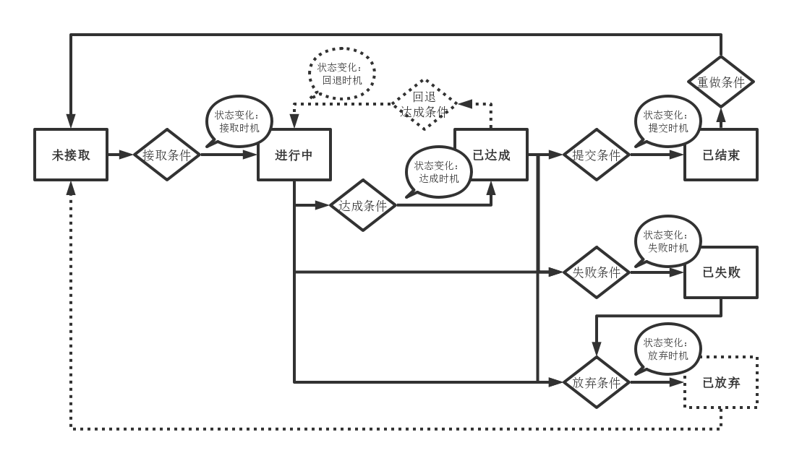
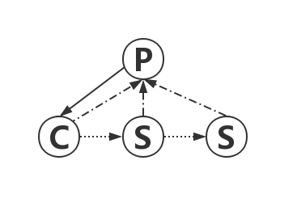
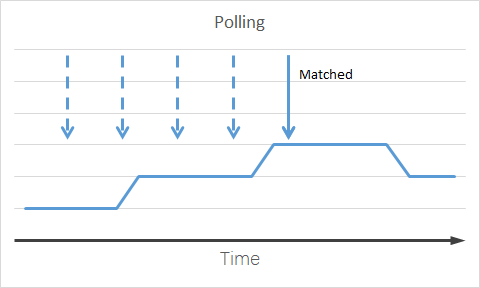
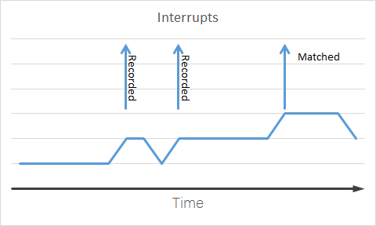

## 任务是什么

我理解的“任务”这个概念可能会对应到包括不限于Task, Mission, Quest这些名词中。如果广义上游戏是对世界的抽象，那么任务就是这个抽象世界里玩家出生、成长、发挥影响力过程中一个又一个的普世目标和存在意义。一方面玩家不得不完成它，另一方面玩家完成了它又会获得这个抽象世界的普世认可。如果狭义上游戏，尤其是RPG游戏，是一个故事，那么任务就是这个故事中一条或多条故事线上的（时间、事件、状态）节点，或驱动后记录玩家历程。

## 当前的任务系统

现行的任务系统不可谓不繁重，区分一个任务是什么就有多个维度：服务器记录的列表类型，封装的逻辑类型，在UI表现时的类型，各种接取方式，能否召唤怪物，能否播放动画等等。以下讨论打算先从逻辑层面入手，视觉表现先放一放。

### 任务的逻辑分类

基于以上假设，我归纳当前我们游戏中的任务系统包含以下逻辑分类。

1. 剧情，这天然是任务系统里的核心元素。
1. 指引，这个比较复杂，它可以是剧情中的一部分，由剧情的串联使玩家建立起对自己角色所拥有能力的认知。又或是游戏本身自己的目标，有义务必须让玩家知道这个抽象世界能做什么。
1. 日常，宏大或遥远的目标容易望而却步，短小重复但重点是积累能力由量变产生质变，小目标适宜达成。
1. 平台期目标，类似于日常，但跨度长了一些，需要几天才能完成的，具有一定的方向性指导。
1. 随机任务，际遇，枯燥世界中的小巧合，增加玩家探索的新鲜感。
1. 合作任务，事件任务，活动任务，如果说以上的任务都是自己与世界之间的关系，那么合作任务是群体参与改造世界的表现。增加玩家之间的参与感以及互动。

### 哪些系统涉及到了任务系统

这些系统是直接或间接跟任务系统有关联的，它们有些是直接引用任务配置，有些依赖任务的一些时间点或进度，有些是直接耦合到任务配置中的。

1. 指引和解锁。与其说这两个系统跟任务有关联，不如说这两个系统依赖一个确切的时间点以及记录进度和状态的能力，恰好任务满足了这两个要求。
1. 探索（区域）、调查和对话。需要记录进度和状态的能力，以及奖励玩家探索的行为。调查、对话这两个系统和任务里的对话令人困惑，任务里的对话有接任务对话，未完成对话，完成对话。对话系统里有分支功能，能提供不同走向。后期任务对话又套用了对话模板，但是UI界面任然是独立的。这是一个开始没设计清晰以及全局规划，后期演化成丑陋功能的问题。既需要地编配置，又需要任务配置，有接取，完成，放弃三个功能。
1. 成就。这个是跟任务双向关联的系统，或者，这个系统其实就是任务系统，理论上不应该独立出现。让它们分离的一个原因是原任务系统配置过于复杂与不清晰。
1. 怪物召唤。利用任务接取，召唤一个只有主角能看到的NPC，以满足剧情等需要。理论上这应该是一个副本功能，但是要在大地图上实现所以这样折中。它存在的问题是如果是只有主角能看到这个NPC，那么其他玩家则会看到主角与看不到的NPC战斗、交互的怪异行为。楚留香、完美世界等游戏对这种需求的处理是在大地图中进入副本区域，问题是进入与退出时NPC状态的衔接不流畅。这个功能是直接耦合到任务配置中的。
1. NPC显隐。为剧情状态服务。
1. 动画播放。任务播放动画，动画播放接取任务。相互利用状态与时间点，经常遇到的问题是在断线重连时，应该以谁为基准重置另一个的状态。这个功能既是是直接耦合到任务配置中的，又有一个单独的枚举配置。
1. 目标追踪、高亮。这个是耦合到任务配置的。
1. 主角的助手（机器人）。以任务接取或完成的时间点驱动助手播放对应的行为。
1. 活动管理器，以活动的开始触发任务，活动结束放弃任务。任务配置引用了活动管理器。

### 遇到的问题与困难

* **潜规则**

这是我认为最致命的一个问题，是工作中几乎是返工最多、被坑次数最多、令人无数次在深夜绝望的一个问题。它的诞生极其简单：“来吧老哥，先这么搞，你加个默认规制不就行了么！” “改一个字段不是还要全部刷数据么，单独加个判断特殊处理一下！” “先跑起来！”然后当遇到错误的时候，大家通常都是一脸懵逼：“之前还是正常的！”

举个例子，在项目早期时，任务目标和任务完成时要显示一句话，于是我们这样实现的：

1. 如果是任务目标，由程序统一规则，按照下列任务目标类型显示
    1. 杀怪，显示：杀怪某某 x/n
    1. 物品，显示：收集物品某某 x/n
    1. ... ...
1. 如果是任务以完成，由程序显示：找到某某某。

是不是很完美？是不是快速实现了原型化？策划很开心，程序很开心，我们都能早下班！直到有一天，有个老哥找到我“老哥，任务目标和完成显示很僵硬，没有带入感，我们能不能自定义一下？哦，原有的默认显示我们就让它存在呗，反正已经做了！”等等，情况没有这么简单，早期定义这个潜规则的时候只有三四条任务目标类型，随着项目的发展与演化，当提到自定义显示的时候已经膨胀到八九条目标类型了，每个类型都要按照其特点（关联不同的表格）做一个默认显示规则，现在又要再做一条可以自定义格式化字符串的逻辑。没关系，没有什么加班不能解决的问题，如果有，那么连着加很多很多天。

需求没有停止，自定义格式化与默认规则并行运行了一个月都很正常，看起来很美好，直到打包的那一个晚上到来，一个错误导致大家进不去游戏了。最后定位到这个错误，发现缘由很简单：默认显示规则要显示**怪物**的名字，而**怪物包**数据没有名字的定义。为什么要引用怪物包的数据而不用怪物数据呢？原因是随着功能的演化，改了需求把怪物配置升级成怪物包配置，当时使用的是自定义格式（没有引用其他数据表）没有出现问题，直到打包前夕使用了一个以为千锤百炼没有问题的潜规则。

这个问题是因为懒惰引起的，如果开始就按照最原子的逻辑去实现，那么返工与Bug就会少一些。上面这个例子只是毛毛多潜规则中的一个，它每次出生的时候都表现的温顺可爱人畜无害，可随着功能的演化，它就会长成一个地雷，然后在每一次打包前后肆意绽放。

* **空白逻辑持续发挥手机余热**

说起来你可能不信，我们有代码上在2017年9月11号就编写了逻辑，然后在今天2019年4月30号还没有使用的功能。任务接取条件：玩家温度上下限。除了这个还有接取时需求技能id数组，也是没有用到的接取条件。极端个例以外，其他大部分是只有少数几个任务使用了的条件被所有任务携带的空白条件逻辑字段。每当打开任务配置表的时候，这些空白逻辑严重的占用了有限的电脑屏幕的宽度，大家在持续烦躁的心情中不断的按下右方向键意图快速的在大海之中找到关键的数据列。客户端程序也痛苦，光接取条件判断就写了200多行。也许服务器更痛苦，因为除了写接取条件，还要写完成条件。

如果它仅仅是安安静静的为手机发热做一点贡献的话，其实也还好，但问题是这些空白逻辑还冷不丁的刷一下存在感：某些配置数据因出生太早，后面加了新的条件后数据文件缺少具体项而报错（空引用error）或者莫名其妙的条件不满足（新加逻辑的同学、原配置任务的同学、程序同学彼此都没有完整的信息而不能直接定位问题，从而浪费大量debug的时间）。

* **完全手动的跨表引用**

跨表不是问题，反而如果按照关系式库的模型来说，最高范式无冗余才是合理的。我们遇到的问题是手动配置各个跨表逻辑的冗余数据。举个配置提交任务的例子：任务配置表里配置了任务完成的提交NPC（服务器不依赖，客户端依赖显示完成提示，还记得一条说的潜规则么！），还需要配置一个提交服务，然后提交服务要加到npc的服务组件里，最后把服务组件填到npc表里。这几个步骤缺一不可，不然分分钟报错给你看。

这样的配表与其他配表耦合度非常高，常常牵一发而动全身。比如地编重新种了NPC并导出，那么其他任务表就要同步修改位置。比如区域触发的任务在区域信息中记录，但是任务配置表里还要记录对应区域的id。

还要就是文本信息的跨表，比如各个物品名字、NPC名字、地图名字等等，现行方案中有一部分（任务目标）是在游戏程序逻辑里分别处理。另一部分（任务说明文本）依赖配置表导出工具进行替换。剩下还有一些文本信息是没有做处理的，比如对话文本。这些复杂且不统一的引用方式非常容易因某一个系统元素改名而造成不容易排查的显示（命名）问题，或者带来不必要的工作量。

* **导出数据与数据源不一致**

数据不一致分两个分类，一个导出的数据落后于excel中的记录，一个是最新部分导出数据使用了新版本（因需求演化而增删改原数据结构或字段名）的结构格式而大部分是旧的。

第一种情况中常常是发现游戏内表现于期望不一致，相关同学确认excel数据源没问题，但是问题出现在导出数据与数据源有差别。这种情况是多发于多人合作中，合作中某一位同学修改了内容而没能及时同步到导出数据，其他人在排查时就会因信息的不完整而浪费工作时间。比如任务接取与提交，这两个错误就多发于各个打包节点，带来的直接影响就是大家要等下一个包才能进行后续工作。

第二种情况简单来说就是数据结构演化时没有全刷表（重新把这个系统的所有数据再导出一遍）。虽然通过全刷表就能解决这个问题，但是它依然广泛发生。究其原因，是每一次最后修改数据结构的同学对全刷表导出数据的正确性没有信心。一个系统的数据表有几千条，由数个同学在长达一两个月的版本迭代中陆续增删改而来。已经导出的数据也因功能、阶段性、测试环境等等改变而造成部分无效、过期。如果某个同学想全刷这个系统的配表，那么他就要承担巨大的核对工作量（依次确认哪些数据要导出以及导出前后的数据变化），或者承担出包后因数据不正确而发生错误的责任风险（无脑导出）。

由第二条派生出一个问题是，导出数据与数据源的集合对应不合理。我们的数据源是一个包含正式数据、测试数据、废弃数据、在开发中数据的一个合集。而导出数据理想情况是只包含正式数据，但大部分时候因开发需要而还包含测试数据，最令人困扰的是导出数据因版本演化还包含了废弃数据以及不在数据源中的数据。造成这个现状的原因，一方面是数据源中对于各个数据类别管理混乱或工具本身提供的限制太少，另一方面是导出数据没有直接到数据源中一对一的映射方式。因为没有确切的集合关系，所以没有办法完整的先行校验数据合法性。现行状态中，对于这个问题，服务器就对部分数据做了一些语法层面和数据关联性的验证，虽然不全面但是已经能减少问题排查的步骤，提升效率。客户端，或者说从数据源头上，还缺少这样的验证机制。

* **链式依赖**

这里指代的链式依赖例如任务A完成条件依赖成就B的达成，成就B的达成条件依赖任务CDEF...的完成。这样的链式依赖就其完成条件来说其实还好，难点在于如何显示当前任务A的进度：如果显示需要达成某成就，那么该成就的进度就需要另跨页面查看；如果直接显示该成就的进度，那么这个逻辑一方面与原逻辑不合，另一方面通用性也不强。

* **任务的多个接取时机**

大多数任务接取条件判断是被动的，当某个NPC携带某些任务时，玩家交互NPC时轮询主角能不能接取任务。比如：

1. 玩家等级、声望、成就
1. 游戏内时间、游戏昼夜
1. 前置、互斥条件
1. ...

另一部分则是无需NPC发任务，而有玩家或系统主动触发的接取时机，比如：

1. 进入区域
1. 活动开启

这些触发条件在与被动条件组合时就容易出现不统一的触发时机。例如进入区域与只有在夜晚才能接取组合，那么玩家在白天进入区域然后挂机等到晚上。对于这种情况原本是被动的接取条件就不得不考虑主动触发尝试接取任务。如果是有限的组合还好打补丁，但是放开了任意组合，恐怕这个补丁逻辑要逆天了。

* **断线以后的连续性**

当前游戏大部分动画播放是区域（场景）和任务（接取或完成）触发的，部分任务的完成条件又是观看指定动画（动画完成时通知服务器完成任务）。对于这样的任务，如果刚好在动画进行一半而掉线，那么重新登陆以后就会进入一个死循环：因为任务已经在玩家身上了，所以不会播放接取时触发的动画；因为没有播放指定的动画，所以也不会完成需要观看动画的这个任务。
为了解决这个问题，我们绕了一个非常复杂的逻辑：

1. 进入区域接取任务
1. 离开地图放弃任务
1. 任务接取时播放动画，动画播完完成任务

这个逻辑能保证玩家掉线后会放弃任务（下线被视为离开地图），上线时重新接取任务（上线算第一次进入区域），因此能完整播放动画。但是还存在因位置同步而导致玩家不在指定区域里，不能继续流程的情况。

### 任务系统的核心功能

我浅薄的从业经验不足以直接定义出什么是构成任务系统的根本要素。从另一个角度来看，当前任务系统本身以及其他相关联系统对任务提出了哪些要求，这些要求可以归纳出什么样的要素。

1. 游戏进程的关键时间点
1. 记录玩家行为数据
1. 携带状态：未接取，进行中，已达成，已结束，已失败
1. 具有连续性的上下文（链式结构），最好支持分支（树形结构）
1. 多类型的（接取或完成）条件组合，支持逻辑关系（and, or）
1. 有多种筛选规则，用于分类、显示、统计等
1. 可以定义触发器检查相应条件而改变任务状态（比如限时任务）

## 如果能重来

### 任务状态以及转移条件

基于现有问题和归纳的核心功能，我们来探讨一下是否有更合理的设计模式。先假设一种任务状态图：



在上图中有五个关键状态，分别是**未接取**、**进行中**、**已达成**、**已结束**、**已失败**。一个隐藏状态已放弃，定义为隐藏状态的原因是已放弃状态可以等同于未接取。然后在这五个状态之间定义了七种**状态转移的条件**，其中“回退达成条件”情况特殊，既可以设计成“达成条件”的逆条件，也可以设计成新定义的条件类型。状态的切换定义出触发机制：“xx时机”。

这个假设省略了“任务更新”时机。通常意义下的“任务更新”是任务目标（或者目标计数）发生变化时会作为消息通知相关系统。但是这个设计没有安排“任务目标”这个要素，而是把“目标”等同于“条件”。所以在这个设计下“任务更新”应该为各个“条件更新”，其他系统如果需要，可以分别监听各个条件的变化。

### 任务之间的组织关系



似乎最天然的任务组织关系就是树形结构。父子任务提供连续上下文信息和逻辑，兄弟任务提供额外的分支或者记录必要的数据。还有就是树结构也能表达分组逻辑，而不用额外的**任务包**配置表单独控制的。

树结构虽然能提供灵活强大的组织方式，但需要完善的配表工具才能发挥效果，否则配置起来相对比较吃力。

### 条件

最简单的条件组织关系是列表，列表中所有条件达成视为总体的达成。但是随着需求的演化，又会需要一个逻辑关系来表述列表中是所有条件同时达成视为总体达成（AND），还是只要有一个条件达成视为总体达成（OR）。同上文任务树一样，表达式树在提供复杂的表达能力同时需要合适的配表工具。

除了条件的组织关系，其实更复杂的是“**条件**”本身。现行的任务系统接取类型有**11**个，接取条件最少**16**条（接取类型与接取条件可以视为都是接取条件），完成类型（条件）和提交条件有**15**种中最多按照指定逻辑关系（AND，OR）完成3条（现在任务系统是把完成条件和提交条件混起来的），失败条件**1**条（超时失败），重做条件**1**条（限次包），放弃条件**2**条（是否玩家手动放弃，是否离开地图放弃）。在当前游戏中，与任务系统99%逻辑类似的成就系统，首次达成条件有**10**类（升级到、创建公会等），积累型条件有**48**类（收集物品、杀怪等）。这些类型在可预见的将来还会不可控制的迅速膨胀。同时在逻辑关系之外，条件的另一个身份是要合理的显示给玩家的，并能有效的指导玩家达成具体条件。

所以对于简化和抽象任务系统这个工作来说，合理的简化和抽象任务的条件，提供完整的显示方案才是重点。多数介绍任务系统的参考文章基本都把条件抽象成一个包含查询函数的基类，然后具体的条件实例再各自继承基类。

```cpp
class Condition{
    virtual bool Match(param);
};

class AND : public Condition{
    virtual bool Match(param){
        return left.Match(param) && right.Match(param);
    }
};

class LevelCondition : public Condition{};
class AreaCondition : public Condition{};

Condition condition = new AND(new LevelCondition(), new AreaCondition());

if(condition.Match(param)){
    //do somethings
}else{
    //do otherthings
}
```

这种抽象从程序角度来看，可以说是非常合理了，但是从策划角度来看却不是很方便，它不能直接使用。那么从策划角度考虑，有下面几个列子：

1. 策划直接配置完整脚本(lua)来定义条件，需要客户端和服务器同时执行。这个方案可以做到非常灵活，程序这边开放指定（少量必要）API就行。存在的问题是配置难度大，多个配置之间的依赖关系不好整理。
1. 使用DSL(Domain Special Language)，指定一些常用关键字和表达式，或者直接使用lua片段。比如：
`((Host.Leval > 10) and (Map.InArea(map=11, index=7)) or Bag.Exist(id=1010101, count=5)`
这个方案需要程序单独写解析程序(DSL)或动态加载脚本(lua)，在需要判断条件时执行，并且相对不太好处理触发类型的条件。为了使表达式尽可能的简单与变量的常量化，需要程序开放完整且特用的API，可以理解为第一个例子的特化简化版，进一步约束了API和脚本的组织形式。
1. 使用类型枚举与参数转义的方式，这个也是当前项目使用的方案。比如：
`[{type:0, param_1:5, param_2:1010101}, {type:1, param_1:10]}, {type:2, param_1:11, param_2:7}`
然后分别约定type=0是收集物品，type=1是玩家等级，type=2是区域判断等等。这么定义的好处是在excel里配置非常方便，坏处是逻辑组织太局限（相当于默认AND逻辑）。为解决这个问题，我们又约定形如`{logic_type:true, target:[{type:0,...},...]}`这样的结构，logic_type用来表达条件枚举数组里的内容是AND逻辑还是OR逻辑。这种方案同样可以理解为上一个例子的特化简化，由枚举数字代替关键字，由约定逻辑代替逻辑表达式。尽管如此挣扎，但是仍然不够，策划同学在想表达的逻辑上还是比较吃力的。

其实这些方案的区别是各自取舍的重点，是要简单配置，还是要灵活表达。就我个人喜好而言，我更推荐第二种，原因是它能兼顾一定的可读性与表达性。但是现在要迁就“**方便配置与灵活**”，我设想是先定义**条件配置表**，然后使用逻辑表达式来定义复合条件。程序在实例化时，将引用条件配置id的表达式解析成上文Condition类的表达式树。比如：

``` JSON
Quest.accept_condition:"(010001 and 010002) or 010003"
Condition:{
    010001:{type:1, param_1:10},
    010002:{type:2, param_1:11, param_2:7},
    010003:{type:0, param_1:5, param_2:1010101}
}
```

这个方法是一定程度上方便了excel与配置表之间的映射，但是损害了可读性，妨碍了后期快速检查能力。可以通过编写一些详细的提示和检查机制来缓解。至于解析效率相关，现在只能说尚没有实践、实测经验，拍脑袋估计问题不是很大（递归下降表达式，不需要回溯，On复杂度，缓存解析结果以优化）。

除了定义具体的条件是什么以外，还要考虑的内容是配置数据或玩家数据在服务器与客户端的**不对称性**。服务器和客户端的关注点不同，所以大家不是完全逻辑对称的。比如一些表现方面的条件，如果不用考虑反外挂的话，那么服务器是可以不用处理的，例如进入夜间进入区域领取任务。而另一些以客户端没有的数据处理系统作为条件，那么客户端也可以不做判断。如果使用条件配置表，我们就可以单独定义条件的忽略条件的各个掩码：
```010004：{type:0, param_1:5, param_2:1010101, ignore:0x06}```
| mask | ignore的定义 |
| :- | :- |
| 0x00 | 没有忽略 |
| 0x01 | 服务器忽略这个条件并返回False |
| 0x02 | 服务器忽略这个条件并返回True |
| 0x04 | 客户端忽略这个条件并返回False |
| 0x08 | 客户端忽略这个条件并返回True |

### 条件的检查方式与计数

* **条件的检查方式**

大家在讨论条件时，会隐含一些条件的检查方式，比如：“如果进入某区域且游戏内时间处于天黑时”，“当活动结束时”，“（找某个NPC接任务时）判断玩家等级是否在某区间”，“如果接取任务后5秒未完成”。如下图列举两种条件的检查方式：轮询与触发。
  
这两种条件检查方式，各有利弊：轮询逻辑简单，不适合大量检查；触发逻辑复杂，功能灵活。我们在定义各个条件时，就需要衡量好这个条件的检查方式，否则如上文[遇到的问题与困难](#1.2.3)中的[任务的多个接取时机](#1.2.3.6)所述，混乱使用不同检查方式，那么就会遇到解决不完的问题。对于当前现行系统中，在NPC身上交接的任务条件大部分是轮询的；通过区域、活动等交接的任务条件是触发的；在进行中的达成条件是触发的。

* **条件计数（执行进度）**

通常意义上的条件计数是指在[任务状态图](#1.3.1)中定义的6(7)种条件中**达成条件**（或包含回退达成条件）用来记录和显示进度的特殊数据，存在于程序，不存在于配置表。例如有部分条件“（从某渠道）获得某物品n次”这样需要记录过去的触发状态；另一部分条件客户端没有对应具体的数据。这两类依赖服务器更新计数来指示进度。而另一些客户端可以自己判断状态，本地更新计数。曾经想要偷懒，希望服务器全权接管计数，客户端只被动更新就行，后面发现还是定义明确，分别去做来的稳妥，一些状态变化还可以同其他类型的条件复用。

### 状态切换时的行为

现行任务系统中默认了一些状态切换时的行为，比如任务完成后接取某任务，也有明确定义的行为，比如任务完成后没收某物品。

### 奖励与奖励预览

### 追踪与关键信息提示

## 总结
