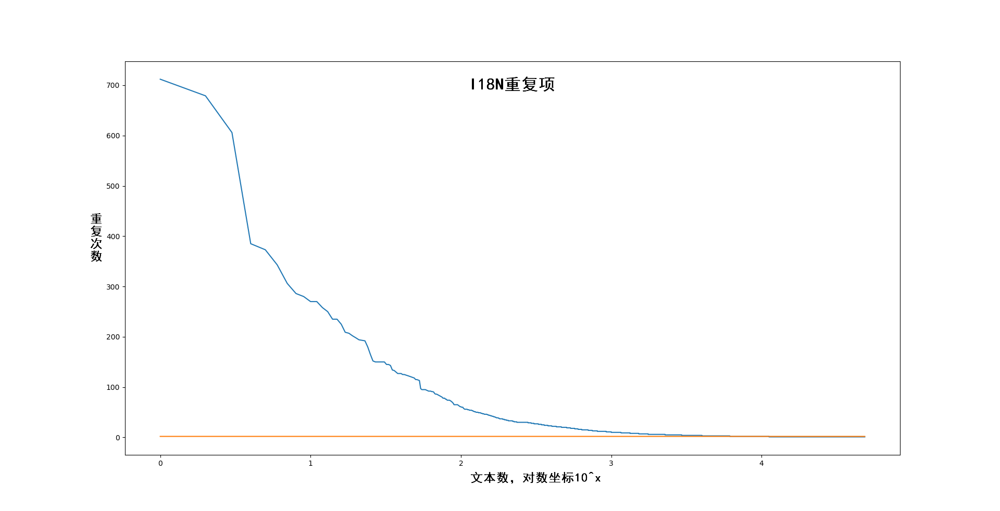

I18N看似是一个不太难的问题，每个人都可以通过短暂的思考就得到的一些方法：文本资源化，具体文本与逻辑解耦，运行时切换语言资源，巴拉巴拉巴拉。但是这个方案应可以应对项目功能的演化、文本规模的膨胀、性能与内存的优化需求么？

<!--more-->

## 吐槽

每个苦难都来自对美好未来的盲目期许。

## 项目中的I18N历史演化

“历史遗留问题”是一个焚化炉，项目里但凡有技术上的疑问与质疑，只要往这个焚化炉里一扔，立刻销匿矛盾。

在项目初期，文本直接在各个系统的配置数据中保存和导出。

后来引入I18N方案，在配置数据表中指定哪些字段是I18N，并同时导出配置数据的结构说明文件，配置数据，以及I18N数据。配置数据与I18N由自动生成的key关联。因为具体的业务逻辑都运行在Lua中，所以导出I18N的数据也直接保存为UTF-8编码的Lua Table文件。在运行时，由加载具体数据的底层模块自动读取I18N的结构说明文件，根据配置数据中的key索引I18N文本后将key换成正确的文本信息。UI Window指定I18N的文本(和图片)组件，保存I18N key在Prefab上并导出I18N文本，UI Window运行初始化时从Lua Table读取静态的I18N文本。

这个方案有一个有点是业务逻辑透明使用I18N文本，全部改造工作由导出工具和底层模块完成。

一年半后的一天任务策划报告全部I18N失效，导出数据没问题但是所有界面显示不正常。排查过后发现是任务数据导出I18N条目过多，行数（5万+）以及数据量大于了单个Lua文件解析上限。马上准备应对策略：

1. 文本拆分，导出工具自己做检查，当导出条目过多时自动拆分文件。
1. 空文本不导出，这个可以极大缓解问题，推迟问题，但是不能解决问题。

因导出工具和导出流程的自身限制(VBA+数值策划兼职写导出工具)，以及项目到达中后期时间节点的紧迫，所以放弃拆分文件这个有难点时间长的方案，采用不导出空文本的方案。

后面为了优化UI相关性能，看到UI的静态I18N没必要通过Lua来倒一手，所以在C#层面单独写了一个UI I18N的加载助手类，自己读取，减少Lua内存开销和Lua到C#的穿透开销。

到此就是项目最终使用的I18N方案了。那么I18N还有优化空间么？

## I18N的数据特征

### 数据规模

到写文章时，项目里由配置表导出工具导出的I18N统计数据见下表：

|I18N类别|数量(条)|占用空间|
|:-|:-|:-|
|包含空白项|xx|---|
|去空白项|xx|xx|
|去重复值项|xx|xx|
|除去Key以后的纯文本|xx|xx|

如上表数据，项目里有近一半I18N数据是空串，剩下一半中文本不重复的项又剩一半。除数量比照之外，我们在导出的大量I18N形式诸如```task_template_task_complete_condition_task_target_1_comment_1000001="杀怪"```，这导致Key占据空间竟然跟文本差不多大。


### 使用场景

上文简单提到UI和配置数据中使用I18N的两个场景，但是不够细化，现统计分类如下：
> “使用率”依赖采样流程，流程不同数据略有差距，只能做定性分析

|分类|数量占比|使用率|
|:-|:-|:-|
|UI静态文本|||
|协议通信或外部模块等返回错误码或状态码的提示信息|||
|业务逻辑中的固定说明文本|||
|业务逻辑中使用的格式化的文本|||

### I18N的使用频率


## 优化方案

### 镣铐

### 从解决重复入手

### 性能相关

### 存在的困难与问题

## 结语
